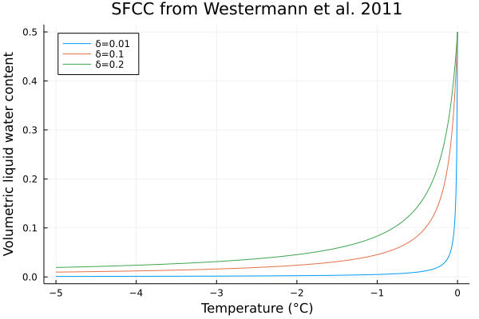

# FreezeCurves.jl

[![][docs-dev-img]][docs-dev-url]

[docs-dev-img]: https://img.shields.io/badge/docs-latest-blue.svg
[docs-dev-url]: https://cryogrid.github.io/FreezeCurves.jl/dev/

`FreezeCurves` is a lightweight Julia package to facilitate the study and analysis of [soil freezing characteristics](https://acsess.onlinelibrary.wiley.com/doi/abs/10.2136/sssaj1966.03615995003000060011x) (Koopmans and Miller, 1966). The relationship between temperature and unfrozen water content in porous media (such as soils) is often highly nonlinear and plays a significant role in the analysis of freeze-thaw dynamics in science and engineering. One common application is in the geophysical modeling of permafrost, where having faithful representations of freeze-thaw processes is often paramount to accurately resolving long-term changes in the subsurface thermal regime.

## Overview

The soil freezing characteristic curve (SFCC) is typically a monotonic function which maps (usually subzero) temperatures [°C] to volumetric unfrozen/liquid water contents [m³/m³]. The SFCC is closely related to the [soil-water retention curve](https://en.wikipedia.org/wiki/Water_retention_curve) (SWRC) which governs the similar non-linear realtionship between soil-water matric potential [m] saturation [m³/m³]. SWRCs are widely used in hydrological modeling, with the two most common formulations being the van Genuchten (1980) and Brooks-Corey (Brooks, 1965) models. SFCCs are less widely known, but numerous models have been proposed over the years (Kurylyk and Watanbe, 2013).

This package is intended to act as a living repository of SFCC/SWRC implementations which can then be fitted to data or consumed downstream by thermal or hydrological models such as CryoGrid (Westermann et al. 2022), or more specifically its [sibling Julia implementation](https://github.com/CryoGrid/CryoGrid.jl).

Currently this package provides implementations of the following freeze curves:

| Name         | Description | Independent variable |
|--------------|-------------|------------|
| `FreeWater`  | Simple, piecewise-linear, enthalpy-based freeze/thaw scheme for pure "free" water. | Enthalpy |
| `PainterKarra` | Coupled temperature-water retention model of Painter et al. (2014) | Temperature |
| `DallAmico`  | Coupled temperature-water retention model of Dall'Amico (2011). | Temperature |
| `DallAmicoSalt`  | Same as `DallAmico` but accounting for freezing point depressions due to salinity. | Temperature |
| `McKenzie`   | Exponential-type empirical model of McKenzie et al. (2007) | Temperature |
| `Westermann` | Nonlinear empirical model of Westermann et al. (2011)  | Temperature |

## Getting started

FreezeCurves.jl can be installed using the Julia package manager:

```
pkg> add FreezeCurves
```
or
```julia
import Pkg
Pkg.add("FreezeCurves")
```

All freezing characteristic curves are implemented as "callable" structs subtyping `SFCCFunction`. Callable structs are those with corresponding method definitions that allow them to be invoked like a function. As an example, we can initialize the freeze curve of McKenzie et al. (2007) with default parameter settings:

```julia
using FreezeCurves

mkfc = McKenzie()
```

The curve can then be evaluated at a particular temperature by calling it as a function:

```julia
mkfc(-1.0u"°C")
# output
1.860037988010418e-44
```

The freeze curve function struct (here `McKenzie`) contains default parameter settings necessary to evaluate the freeze curve. These can also be customized on construction. We could, for example, use a different value for the shape parameter, γ [K]

```julia
mkfc2 = McKenzie(γ=1.0u"K")
mkfc2(-1.0u"°C")
# output
0.18393972058572117
```
which results in a much longer curve with more than 18% unfrozen water content by volume at -1.0 °C!

All freeze curves also accept their parameters (excluding some constants) as function arguments, with default values set to those found in the struct. For example, the full method signature for `McKenzie` is:

`(f::McKenzie)(T; θtot, θsat, θres, Tₘ, γ)`

where `θtot` is the total (volumetric) water content (water + ice), `θsat` is the saturated water content (a.k.a natural porosity), `θres` is the residual water content, `Tₘ` is the melting temperature, and `γ` is the aforementioned shape parameter. We could have, therefore, adjusted the shape parameter by simply setting the keyword argument for our original `mkfc`:

```julia
mkfc(-1.0u"°C", γ=1.0u"K")
# output
0.18393972058572117
```

In cases where it is more convenient/appropriate to modify the default parameter values in the struct itself, it's worth noting that some parameters are nested one or two levels deep, e.g. setting the saturated water content (porosity) for a `DallAmico` freeze curve would look like:

```julia
dafc = DallAmico(swrc=VanGenuchten(water=SoilWaterVolume(θsat=0.75)))
```
This is admittedly somewhat unwieldy, so `FreezeCurves` re-exports `@set!` from [Setfield.jl](https://github.com/jw3126/Setfield.jl) to make this a bit easier:

```julia
dafc = DallAmico()
@set! dafc.swrc.vol.θsat = 0.75
dafc.swrc.vol.θsat
# output
0.75
```

Note also that FreezeCurves.jl **strictly uses unitful quantities** (from [Unitful.jl](https://github.com/PainterQubits/Unitful.jl)) to ensure physical coherence and avoid confusion between temperature units. The macro `u"°C"` applies units of degrees Celsius to the floating point number `-0.1` (the degree symbol can be typed in the Julia REPL or editor using `\degree` followed the `TAB` key). Speical method dispatches for `ustrip` are provided for freeze and water retention curve function types that will automatically strip the units from all fields nested within the function struct. **When used without units, all temperatures are assumed to be in degrees Celsius (°C)!**

```julia
mkfc_nounits = ustrip(mkfc)
mkfc_nounits(-0.1)
# output
0.1839397205856375
```

FreezeCurves.jl also provides some basic plotting recipes to help rapidly visualize freeze curves, e.g:

```julia
using Plots

Trange = -5.0u"°C":0.01u"K":0.0u"°C"
plot(Trange, Westermann(δ=0.01u"K"), label="δ=0.01", title="SFCC from Westermann et al. 2011")
plot!(Trange, Westermann(δ=0.1u"K"), label="δ=0.1")
plot!(Trange, Westermann(δ=0.2u"K"), label="δ=0.2")
```



For more details and examples, see the [documentation]().

## References

Brooks RH. Hydraulic properties of porous media. Colorado State University; 1965.

Dall'Amico M, Endrizzi S, Gruber S, Rigon RJ. A robust and energy-conserving model of freezing variably-saturated soil. The Cryosphere. 2011 Jun 1;5(2):469-84.

Koopmans RW, Miller RD. Soil freezing and soil water characteristic curves. Soil Science Society of America Journal. 1966 Nov;30(6):680-5.

Kurylyk BL, Watanabe K. The mathematical representation of freezing and thawing processes in variably-saturated, non-deformable soils. Advances in Water Resources. 2013 Oct 1;60:160-77.

McKenzie JM, Voss CI, Siegel DI. Groundwater flow with energy transport and water–ice phase change: numerical simulations, benchmarks, and application to freezing in peat bogs. Advances in water resources. 2007 Apr 1;30(4):966-83.

Westermann S, Boike J, Langer M, Schuler TV, Etzelmüller B. Modeling the impact of wintertime rain events on the thermal regime of permafrost. The Cryosphere. 2011 Oct 26;5(4):945-59.

Westermann S, Ingeman-Nielsen T, Scheer J, Aalstad K, Aga J, Chaudhary N, Etzelmüller B, Filhol S, Kääb A, Renette C, Schmidt LS. The CryoGrid community model (version 1.0)–a multi-physics toolbox for climate-driven simulations in the terrestrial cryosphere. Geoscientific Model Development Discussions. 2022 Jun 7:1-61.

Van Genuchten MT. A closed‐form equation for predicting the hydraulic conductivity of unsaturated soils. Soil science society of America journal. 1980 Sep;44(5):892-8.
